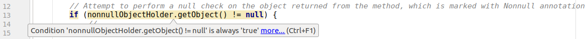
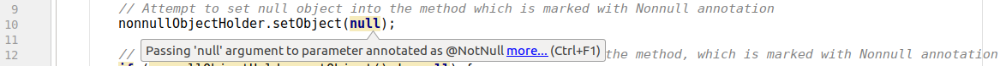

## JSR 305: Annotations for Software Defect Detection

### Notes

##### General
At the moment, [JSR-305](https://jcp.org/en/jsr/detail?id=305) is in Dormant status, so it is not advised to use it

##### Description
Below you can see useful application of `@Nonnull` and `@Nullable` annotations and hints provided by [IntelliJ IDEA](https://www.jetbrains.com/idea/)

##### Prerequisites
1. [Maven](https://maven.apache.org/)
2. [IntelliJ IDEA](https://www.jetbrains.com/idea/)

### Use cases

##### Non-null object hints
We have a class with two methods, `setObject` which does not allow null objects and `getObject` which does not provide a null object
```
public class NonnullObjectHolder implements ObjectHolder {

    private Object object;

    public void setObject(@Nonnull final Object object) {
        this.object = object;
    }

    public @Nonnull Object getObject() {
        return object;
    }

}
```
Marking method parameters and/or return type with `@Nonnull` annotation does not prevent developers from passing `null` objects or calling methods on objects which might be `null`, but [IntelliJ IDEA](https://www.jetbrains.com/idea/) highlights such cases and signals developers that something is potentially wrong. For example, code below compiles successfully
```
public class Main {

    public static void main(final String[] arguments) {
    // Object holder which does not allow null objects
        final NonnullObjectHolder nonnullObjectHolder = new NonnullObjectHolder();
    
        // Attempt to set null object into the method which is marked with Nonnull annotation
        nonnullObjectHolder.setObject(null);
    
        // Attempt to perform a null check on the object returned from the method, which is marked with Nonnull annotation
        if (nonnullObjectHolder.getObject() != null) {
            // ...
        }
        
    }

}
```
The real value comes from [IntelliJ IDEA](https://www.jetbrains.com/idea/) hints

Case when we try to pass `null` as an argument to the of the method which is marked `@Nonnull`



Case when we try to perform `null` check on the object returned by method which return type is marked `@Nonnull`


